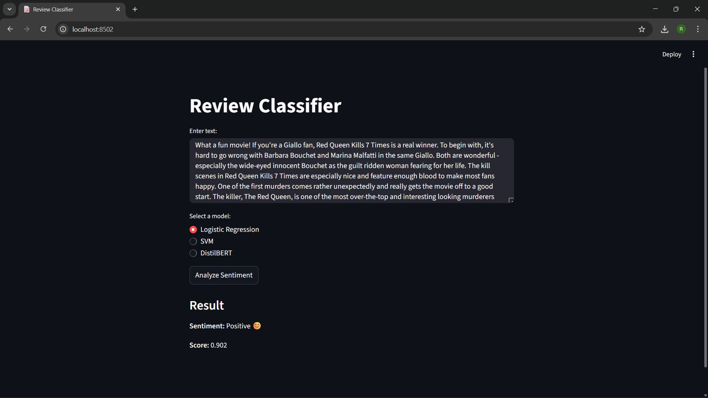

# Review Classifier

**Review Classifier** is an interactive web application built with **Streamlit** that performs **sentiment analysis** on user-provided text. It allows users to classify reviews or text as **positive or negative**, using multiple machine learning models including Logistic Regression, SVM and DistilBERT.

---

---

## 🛰️ Try it Live

👉 [Open App](https://review-classifier.streamlit.app/)

---

## Features

- **Text Input:** Enter any review, comment or text snippet.
- **Model Selection:** Choose from three models:
  - Logistic Regression
  - SVM
  - DistilBERT (pre-trained transformer)
- **Sentiment Analysis: Results**
  - Sentiment label
  - Emoji representation 😊 ☹️
  - Confidence score
- Displays a “Please wait…” message while processing.
- Training scripts and experiments done in Google Colab Notebook

---